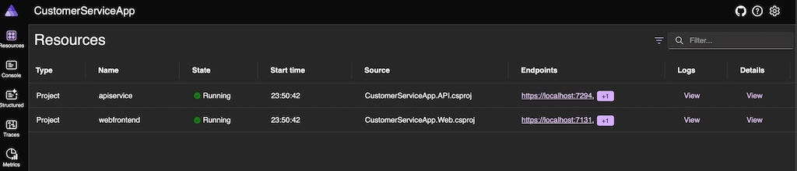
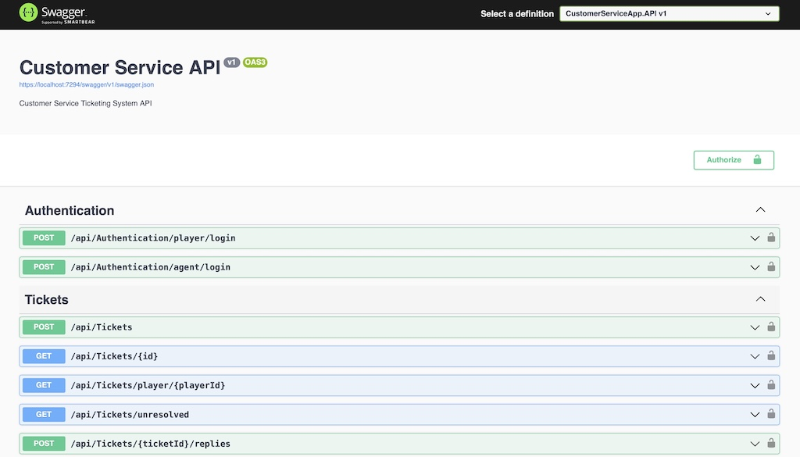
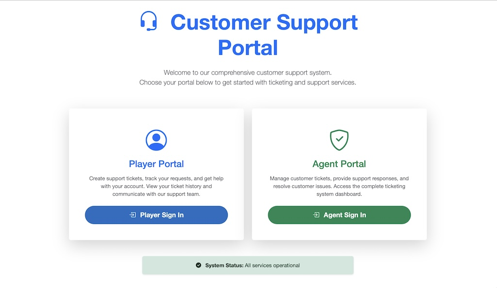
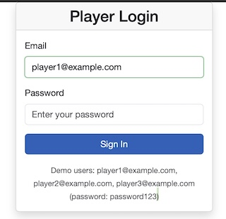
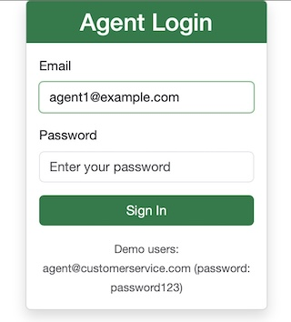
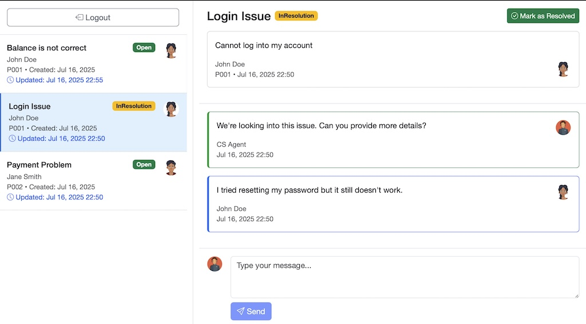
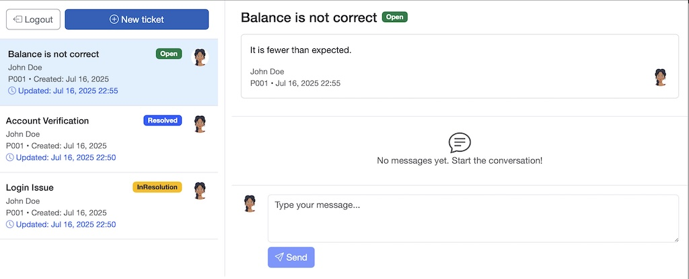
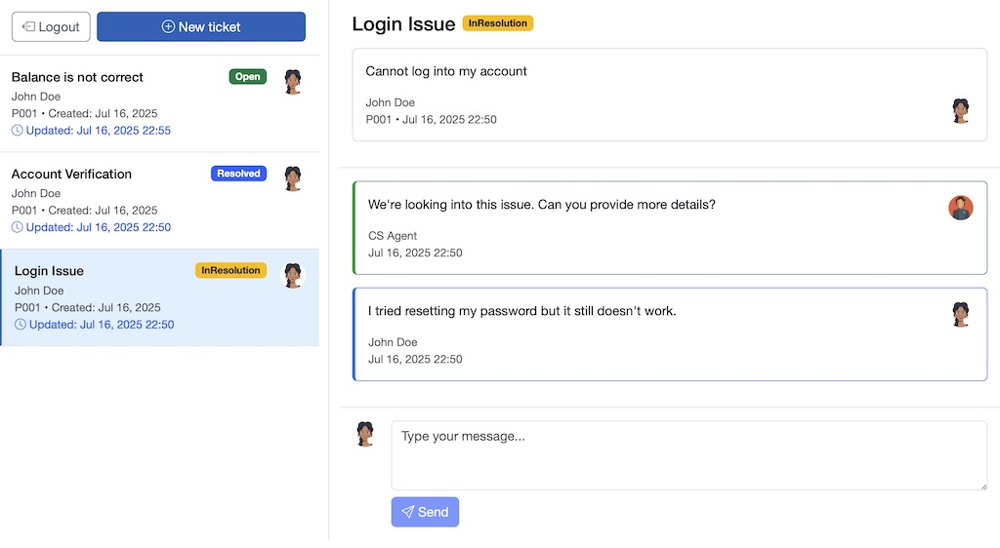
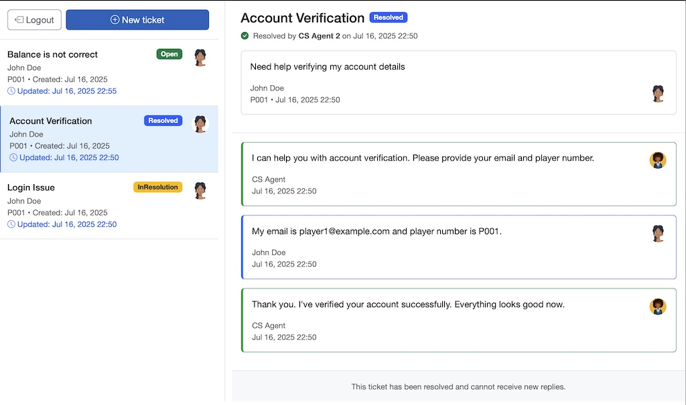
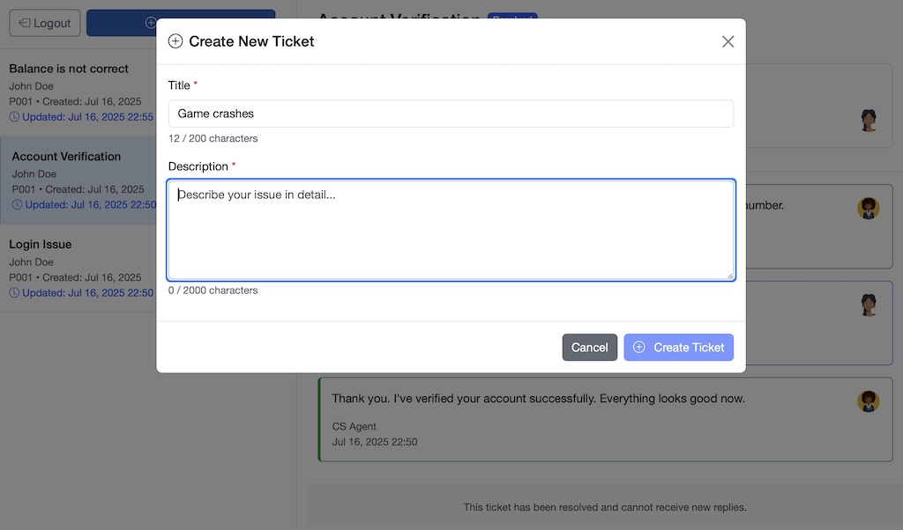

# Customer Support Ticketing System

## Requirements

- [x] Ticket Creation: Allow creation of new support tickets with subject and
description.
- [x] Ticket List View: Display a list of unresolved support tickets with their subject, username, user ID and placeholder avatar.
- [x] Ticket Detail View: Allow viewing the full details of a ticket, including a
chronological thread of replies.
- [x] Reply to Ticket: Support agents should be able to add replies to a ticket.
- [x] Status Updates:
    - [x] A ticket starts as “Open”.
    - [x] It becomes “In Resolution” when an agent replies.
    - [x] It can be manually marked as “Resolved” by the agent.

### Backend
- Use .Net 8 for the backend.
- Expose a RESTful API to manage tickets and replies.
- Store data using SQLite or in-memory storage.
- Apply clean code principles and design patterns (e.g., Repository, Service Layer, Dependency Injection).
- Include unit tests for core logic (status updates, reply handling, etc.).

### Frontend
- Use any modern JavaScript framework of your choice: Blazor, React, Vue, or Angular.
- Implement the UI with:
    - Ticket list
    - Ticket detail + replies thread
- Forms to reply and create new tickets
- Interact with the backend using proper API calls.
- Demonstrate effective state management

## How to run
To run with Aspire dashboard, execute at project root directory:
```
dotnet run --project CustomerServiceApp.AppHost
```

To run the backend and frontend individually:
```
dotnet run --project CustomerServiceApp.API -lp https
// and
dotnet run --project CustomerServiceApp.Web -lp https
```

Note that the `-lp` switch for https is required to pass CORS check.

## Requirement Analysis
- There are the entities in the system:
    1. Customer (Player) - Who file customer service ticket.
    2. Customer Service Agent (Agent) - Who handle the customer support tickets.
    3. Ticket - Initiated by a player of what happened. 
    4. Reply - Initiated by either a player or an agent.
- Each Reply contains:
    - Id - unique identifier of a reply
    - What - The message content
    - Who - A player / an agent
    - When - The time
- Each player and agent is a user that:
    - Has an Id - unique identifier
    - Has an email as user name
    - Has a name
    - Has an avatar in blob url format
    - Has password hash
    - Player has an additional field: player number
- Each ticket contains:
    - Id - unique identifier 
    - Creator - Player
    - Status - from ["Open", "In Resolution", "Resolved"], the initial status is open. When ever an agent replies the ticket status will change to in resolution if it is in open status. When an agent click resolve, and the ticket is in resolution status, it will change to resolved.
    - Title - Ticket title
    - Description - Message content
    - CreatedDate - The timestamp that the thread created.
    - LastUpdateDate - The timestamp that the thread created, the last message created in that thread or when the ticket is resolved.
    - Messages - A list of messages from both player and agents, sort by message date in ascending order.
    - ResolvedBy - The agent who resolved the ticket

## Assumptions
- Once a message is send, it cannot be edited for integrity.
- All CS Agents share the same avatar and share the same name "CS Agent".
- The list of tickets shows only "open" and "in resolution" tickets.
- The buttons of creating a new ticket and resolving a ticket is limited to player.
- When a player sign-in, they can only see their own tickets on the ticket list.
    - Player can see all tickets on ticket list, including resolved tickets, in reverse chronological order.
- When an agent sign-in, they can see all tickets that are open or in-resolution.
- There will be two sign-in pages:
    - One for player
    - One for agent
- Ticket can be handled by any agent, no assignment required.
- Assume user will refresh the page to load latest ticket status.
- Player can only see their own tickets on the list.
- Player can reply their tickets.
- Agent can see all tickets from any player on the list.
- Agent can reply to any ticket.  
- Only Player can create new ticket.
- Player can see resolved tickets on the list.

## Technical Decisions
- Using In-memory database due to keeping the project as simple as possible without external dependencies, this make sure user can run on their machine regardless of platform. As data persistency is not a mandatory in requirements.
- Using Entity Framework is not mandatory, as a clear data access layer should abstract the infrastructure and underlying implementation details. The same data access API should work with different storage provider interfaces.
- Basic username and password are used as authentication mechanism as the project is not aim for secure production use, in real world we should use more secure approach like OAuth + MFA. 
- Due to the same reason the agent or user account management is not included in this project.
- The Mapper classes was created to make our methods idempotent. We are not using AutoMapper in this project to keep the dependencies to minimum for simplicity, ensuring smooth `dotnet restore` process for code user.

## Design
- This project will be built with domain driven design (DDD) with test driven development (TDD)
    - At the time of submission, there are total 201 tests created.
    - The Front-end project has the lowest test coverage (23%)
    - The Infrastructure and Application project has 65-68% test coverage
    - The Domain and API project has 93-98% test coverage

- We will use .NET Aspire to orchestrate the following projects:
    - Domain Model
    - Infrastructure - EF Core, repositories, external services. 
    - Application - Orchestration of business logic and domain objects.
    - API - REST API endpoints from Web API / Minimal API.
    - Web - Blazor WASM front-end client.
    - UnitTests
    - Integration Tests
    - E2E Tests - Selenium for testing UI behavior - omitted due to time limit, will add after submission

- It is arguably that we should have different independently deployable services for authentication user and ticket management. However for this project scale it is a bit over-engineering. Instead we will focus on separating concerns into isolated service and controller classes.
- Due to the lack of user management, user and agent records are seeded during application startup.
- We will use JWT with short exp for session management. 
- We will use Redux style dispatch and mutate pattern for frontend state management.
- We will use CDN Bootstrap styles for frontend UI styles for simplicity.
- For front-end state management, create classes:
  - AppState - An object to hold the application state, ideally in record type.
  - AppStateStore - A centralized state management store in Redux approach.
    - It holds an instance of AppState which is immutable from outside. 
    - The app state can only be modified from the private mutation methods. 
    - The store will expose public dispatch and query methods that will call the mutation methods.
    - It always return a immutable copy of the app state when query.
  - The AppStateStore is registered as a singleton in DI container, injected into pages. 

## Security Configuration

### Password Hashing
The system uses PBKDF2 with salted hashing for secure password storage:

1. **Development Setup**: Passwords are hashed using user secrets
   ```bash
   # Set the salt (minimum 32 characters)
   dotnet user-secrets set "PasswordHasher:Salt" "your-secure-salt-here" --project CustomerServiceApp.API
   
   # Set iterations (default: 100,000)
   dotnet user-secrets set "PasswordHasher:Iterations" "100000" --project CustomerServiceApp.API
   ```

2. **Production Setup**: Configure via environment variables or secure configuration, this is a simplified approach for this project. In real world application this should comes from AWS / GCP SecretManager or Azure KeyVault.

   ```json
   {
     "PasswordHasher": {
       "Salt": "REPLACE_WITH_SECURE_SALT_IN_PRODUCTION",
       "Iterations": 100000
     }
   }
   ```

**Security Features:**
- PBKDF2 with SHA-256 for password hashing
- Configurable salt for additional security
- Configurable iterations for performance/security balance
- User secrets integration for development
- No plaintext passwords stored in configuration

## Possible enhancements
- Use better authentication mechanism like OAuth and MFA.
- Use real database for persistent data storage.
- Queuing mechanism to fetch and processing ticket requests to avoid overwhelm infrastructure.
- Separate APIs by concern into individual deployable units.
- CI/CD pipeline with test automation
- Cloud deployment
- Caching mechanism to improve frequent reading tickets loading time.  
- Using Signalr for ticket update notifications and refresh.
- Paging mechanism for loading tickets and messages in a ticket thread.
- Apply rate limit to APIs
- Making the list of message replies in scrollable pane with sticky message reply input at bottom.
- More robust token authentication and authorization with id, access, and refresh tokens instead of single JWT.
- Use cloud blob storage to host user's avatar images

## Screenshots

### Aspire Dashboard


### API Swagger Doc


### Home Page


### Player Login


### Agent Login


### Agent Ticket Management


### Player Ticket - Open


### Player Ticket - In Resolution


### Player Ticket - Resolved


### Player Ticket - Create Ticket



## Change Log

### Version 1.34.0 - GetUnresolvedTicketsAsync API Optimization
- **CustomerServiceApp.Web v1.34.0**: Enhanced API efficiency for agent ticket operations

#### 🚀 **NEW FEATURES**:
- **GetUnresolvedTicketsAsync Method**:
  - Added dedicated API method in `ApiService` for retrieving unresolved tickets specifically for agents
  - Direct call to `/api/tickets/unresolved` endpoint eliminating unnecessary client-side filtering
  - Improved performance by reducing data transfer and processing overhead
  - Enhanced separation of concerns with server-side filtering for agent-specific operations

### Version 1.33.0 - AgentTickets Page Component Integration
- **CustomerServiceApp.Web v1.33.0**: Updated AgentTickets page to use extracted components for consistency and maintainability

#### 🚀 **NEW FEATURES**:
- **Component-Based Architecture**: AgentTickets now uses the same structure as PlayerTickets
  - Integrated TicketListItem component for consistent ticket display
  - Uses MessageCard component for message rendering
  - Employs MessageReplyInput component for reply functionality
  - Unified state management using AppStateStore

#### ⚠️ **BREAKING CHANGES**:
- Integration tests require updating to match new component-based architecture
- Old static data structure replaced with dynamic API-driven data

### Version 1.32.0 - TicketListItem Component Extraction
- **CustomerServiceApp.Web v1.32.0**: Extracted reusable TicketListItem component for ticket list display

#### 🚀 **NEW FEATURES**:
- **TicketListItem Component**:
  - Clean, reusable component for displaying ticket items in lists
  - Accepts Ticket (TicketDto), IsSelected (bool), and OnTicketSelected (EventCallback) parameters
  - Handles selection state with visual feedback (selected CSS class)
  - Shows ticket title, status badge, creator info, and avatar
  - Proper date formatting for creation and last update times
  - Click handling with custom callback support

### Version 1.31.0 - MessageCard Component Extraction
- **CustomerServiceApp.Web v1.31.0**: Extracted reusable MessageCard component for message display

#### 🚀 **NEW FEATURES**:
- **MessageCard Component**:
  - Clean, reusable component for displaying messages in ticket threads
  - Accepts Message (ReplyDto) and IsFromAgent (bool) parameters
  - Handles different styling for agent vs player messages
  - Shows appropriate avatars with fallback icons
  - Consistent message formatting with proper date display
  - Eliminates code duplication across pages

### Version 1.30.0 - Simplified MessageReplyInput Component
- **CustomerServiceApp.Web v1.30.0**: Simplified MessageReplyInput component focusing on essential functionality

#### 🚀 **NEW FEATURES**:
- **MessageReplyInput Component**:
  - Clean, focused component for message reply input functionality
  - Leverages AppStateStore for user information and loading states automatically
  - Simple parameter set: Ticket, ReplyText, ReplyTextChanged, OnSendReply
  - Automatic avatar display based on AppStateStore.CurrentUser data
  - Built-in loading state management from AppStateStore.IsLoading

### Version 1.29.0 - MessageReplyInput Component Extraction
- **CustomerServiceApp.Web v1.29.0**: Extracted reusable MessageReplyInput component for code deduplication

#### 🚀 **NEW FEATURES**:
- **MessageReplyInput Component**:
  - Created flexible MessageReplyInput.razor component supporting both player and agent ticket pages
  - Dynamic ticket type support: handles TicketDto (PlayerTickets) and TicketViewModel (AgentTickets) via reflection
  - Dual callback architecture: OnSendReply (async) for PlayerTickets, OnSendReplyAction (sync) for AgentTickets
  - Configurable avatar display: ShowUserAvatar parameter switches between user avatar and custom icons
  - Parameterized styling: AvatarIconClass, AvatarIconColor, and PlaceholderText for page-specific customization

### Version 1.17.0 - Enhanced Player UX & Role-Based UI Controls
- **CustomerServiceApp.Web v1.17.0**: Improved player experience with proper role-based interface design

#### 🚀 **NEW FEATURES**:
- **Role-Based UI Controls**:
  - Removed resolve ticket button from PlayerTickets.razor (only agents should resolve tickets)
  - Eliminated ResolveTicket method from player interface for proper role separation
  - Clean, focused player interface without administrative controls

- **Enhanced Reply Functionality**:
  - Advanced loading states with spinner and "Sending..." feedback during reply submission
  - Smart form validation: disabled send button when text is empty or system is loading
  - Disabled textarea during loading to prevent multiple submissions
  - Seamless user experience with proper visual feedback

#### 🛡️ **SECURITY & CONSISTENCY**:
- **Player-Specific API Integration**: SendReply method now uses GetPlayerTicketsAsync consistently for all data operations
- **Improved Data Consistency**: Enhanced reply refresh logic maintains both ticket list and detail view synchronization
- **Fallback Error Handling**: Robust fallback to SelectTicket method when API responses are unexpected

### Version 1.16.0 - Player-Specific API Integration & Enhanced Security
- **CustomerServiceApp.Web v1.16.0**: Enhanced player experience with optimized ticket loading

#### 🚀 **NEW FEATURES**:
- **Player-Specific API Integration**:
  - Added `GetPlayerTicketsAsync()` method to `ApiService` for player-specific ticket fetching
  - Updated `PlayerTickets.razor` to use `/api/tickets/player/{playerId}` endpoint instead of generic tickets endpoint
  - Enhanced security by ensuring players only fetch their own tickets at the API level
  - Improved performance by reducing data transfer (TicketSummaryDto vs full TicketDto for list view)

### Version 1.15.0 - Enhanced Player Experience & Direct DTO Usage
- **CustomerServiceApp.Web v1.10.0**: Added logout functionality and simplified authentication models
- **CustomerServiceApp.IntegrationTests v1.1.0**: Enhanced test coverage for UI interactions
- **CustomerServiceApp.Application v1.11.0**: Enhanced AppStateStore with comprehensive exception logging
- **CustomerServiceApp.UnitTests v1.4.0**: Comprehensive testing for local storage functionality and logging

#### 🚀 **NEW FEATURES**:
- **Enhanced Player Interface**:
  - Added logout button to player tickets page for easy session termination
  - Logout button positioned left of "New ticket" button with clean responsive design
  - One-click logout with automatic navigation back to player login page
  - Proper state cleanup using `DispatchLogoutAsync()` for session management

- **Local Storage Persistence**: 
  - Automatic persistence of authentication state (user, token, expiration) to browser local storage
  - State restoration on application startup with automatic token expiration handling
  - Graceful error handling for storage failures and invalid data
  - Authorization header restoration for seamless API integration

### Version 1.10.1 - Blazor Component Lifecycle Fixes
- **CustomerServiceApp.Web v1.4.1**: Fixed production runtime errors with proper lifecycle management

#### 🐛 **BUG FIXES**:
- **Blazor Component Lifecycle Management**: 
  - Fixed "duplicate subscription" error in Home component using proper `OnAfterRender(firstRender)` pattern
  - Replaced `OnInitialized` with `OnAfterRender` to ensure single event subscription per component instance
  - Eliminated async warnings by removing unnecessary async/await in authentication check methods
  - Proper disposal pattern with `IDisposable` implementation for event unsubscription

### Version 1.10.0 - App State Management & Functional Authentication
- **CustomerServiceApp.Web v1.4.0**: Complete Redux-pattern state management and functional sign-in implementation

#### 🚀 **NEW FEATURES**:
- **Redux-Pattern App State Management**:
  - `AppState` record with immutable application state (user, tickets, loading states, messages)
  - `AppStateStore` singleton with centralized state management and event-driven updates
  - Complete dispatch/mutation pattern for state changes (login, logout, ticket operations)
  - Type-safe state queries with computed properties (IsAuthenticated, IsPlayer, IsAgent)

- **Functional Authentication Pages**:
  - `PlayerLogin.razor` with form validation, error handling, and JWT authentication
  - `AgentLogin.razor` with role-specific styling and agent authentication
  - `LoginModel` for mutable form binding with DTO conversion
  - Real-time form validation using DataAnnotations and EditForm components
  - Loading states with spinner indicators and disabled controls during authentication

- **HTTP Client Integration**:
  - `ApiService` for structured API communication with JSON serialization
  - JWT token management with authorization header configuration
  - Error handling and null-safe API responses
  - Support for all authentication and ticket operations

### Version 1.9.0 - EF Core Infrastructure & Repository Pattern Completion
- **CustomerServiceApp.API v1.7.0**: Enhanced ticket reply functionality with proper EF Core integration
- **CustomerServiceApp.Application v1.9.0**: Comprehensive reply handling with balanced domain/repository approach
- **CustomerServiceApp.Infrastructure v1.5.0**: Complete repository pattern implementation with Reply repository

#### 🔧 **INFRASTRUCTURE FIXES**:
- **EF Core Tracking Issues Resolved**: 
  - Fixed "Attempted to update or delete an entity that does not exist in the store" error when adding replies
  - Implemented complete `IReplyRepository` with CreateAsync, GetByIdAsync, GetByTicketIdAsync operations
  - Enhanced `UnitOfWork` pattern with Reply repository support and lazy loading
  - Proper entity tracking for complex relationships (Ticket → Reply, User → Reply)

- **Repository Pattern Completion**:
  - `ReplyRepository` implementation with EF Core Include statements for Author navigation
  - Unit of Work coordination across Tickets, Users, and Replies repositories
  - Consistent async operations pattern across all repository implementations

### Version 1.8.0 - Complete JWT Authentication & Authorization System
- **CustomerServiceApp.API v1.6.0**: Production-ready JWT authentication and authorization with comprehensive security
- **CustomerServiceApp.Application v1.8.0**: Enhanced clean architecture with authentication services and role-based authorization
- **CustomerServiceApp.Infrastructure v1.4.0**: Complete JWT infrastructure with token services and database initialization
- **CustomerServiceApp.UnitTests v1.2.0**: Comprehensive test coverage with 101 total tests (89 unit + 12 integration)

#### 🚀 **NEW FEATURES**:
- **Complete JWT Authentication System**: 
  - Role-specific login endpoints: `/api/authentication/player/login` and `/api/authentication/agent/login`
  - JWT token generation with role-based claims (Player/Agent)
  - Secure token validation with proper error handling
  - Cross-role authentication prevention (players cannot login as agents and vice versa)

- **Role-Based Authorization**:
  - `[Authorize(Roles = "Player")]` for player-specific endpoints
  - `[Authorize(Roles = "Agent")]` for agent-specific endpoints  
  - Proper 401/403 responses for unauthorized access attempts
  - JWT middleware integration with ASP.NET Core authorization

- **Database Integration & Seeding**:
  - Automatic database initialization on application startup
  - Development seed data with 3 players, 1 agent, and sample tickets
  - In-memory Entity Framework Core with proper relationship mapping
  - Production-ready configuration with environment-based seeding

### Version 1.3.2
- **CustomerServiceApp.Infrastructure v1.1.2**: Fixed validation annotations for security options
  - **FIXED**: Added missing validation attributes to `PasswordHasherOptions.Salt` property
    - Added `[Required]` validation to ensure salt is not empty
    - Added `[MinLength(32)]` validation for minimum salt security requirement
    - Ensures consistent use of Microsoft validation framework across all options classes
  - **Quality**: All 62 tests passing, Release build successful

### Version 1.3.1
- **CustomerServiceApp.Infrastructure v1.1.1**: Enhanced security with hardened password hashing
  - **SECURITY**: Upgraded `PasswordHasher` from basic SHA256 to PBKDF2 with salt
    - PBKDF2 with SHA-256 for cryptographically secure password hashing
    - Configurable salt via user secrets or environment variables
    - Configurable iterations (default: 100,000) for performance/security balance
    - User secrets integration for secure development configuration
    - Production-ready configuration options with environment variables
  - **NEW**: `PasswordHasherOptions` configuration class with validation
    - Minimum 32-character salt requirement with validation attributes
    - Configurable iteration count with range validation
    - Microsoft Extensions Options pattern integration
  - **Enhancement**: Updated database seeding to use secure password hashing
    - All seeded users now use properly hashed passwords via PBKDF2
    - Development passwords clearly marked and documented
  - **Testing**: 11 comprehensive unit tests for `PasswordHasher` with 100% coverage
    - Tests for consistent hashing, password verification, and edge cases
    - Support for various password types including Unicode characters
    - Security validation for incorrect passwords and empty inputs

- **CustomerServiceApp.API v1.1.0**: Security configuration enhancements
  - **NEW**: User secrets support for secure development configuration
  - **NEW**: Password hasher configuration in appsettings with production guidance
  - **Security**: Proper separation of development and production configuration

### Version 1.3.0
- **CustomerServiceApp.Infrastructure v1.1.0**: Complete infrastructure layer implementation with Entity Framework Core
  - **NEW**: `CustomerServiceDbContext` with Entity Framework Core 8.0.0 configuration
    - Table Per Hierarchy (TPH) inheritance mapping for User/Player/Agent entities
    - Comprehensive entity configuration with relationships and constraints
    - Unique indexes for Email fields and PlayerNumber validation
    - Proper navigation properties with cascading delete policies
  - **NEW**: `UserRepository` and `TicketRepository` implementing application layer interfaces
    - Full async CRUD operations with proper Include statements for eager loading
    - Efficient database queries with navigation property loading
    - Repository pattern implementation following clean architecture principles
  - **NEW**: `UnitOfWork` pattern for transaction management and repository coordination
    - Lazy-loaded repository instances for optimal performance
    - Centralized SaveChanges coordination across multiple repositories
    - Proper disposal pattern implementation
  - **NEW**: `Mapper` service for comprehensive domain-DTO transformations
    - Complete mapping between domain entities and application DTOs
    - Null-safe conversion methods with proper validation
    - Support for all entity types (User, Player, Agent, Ticket, Reply)
  - **NEW**: `ServiceCollectionExtensions` with complete dependency injection configuration
    - Registration of all infrastructure services and repositories
    - Database context configuration with in-memory provider
    - Automatic database initialization and sample data seeding
    - Sample users (3 players, 1 agent) and tickets for development testing
  - **Feature**: Microsoft Entity Framework Core 8.0.0 with InMemory provider
  - **Feature**: Table Per Hierarchy inheritance strategy for optimal performance
  - **Feature**: Comprehensive database seeding with realistic test data
  - **Quality**: Zero compilation errors, all 16 tests passing with 100% domain coverage

### Version 1.3.0
- **CustomerServiceApp.API v1.3.0**: Clean Architecture interface organization and authentication improvements
- **CustomerServiceApp.Application v1.9.0**: Major architectural refactoring for Clean Architecture compliance
- **BREAKING CHANGE**: Interface namespaces reorganized following Clean Architecture pattern
  - Moved `IUserService` from `Common.Interfaces` to `Users` namespace
  - Moved `ITicketService` from `Common.Interfaces` to `Tickets` namespace  
  - Moved `IAuthenticationService` from `Common.Interfaces` to `Authentication` namespace
- **Enhancement**: Fixed Single Responsibility Principle violation
  - Removed authentication logic from `UserService` class
  - `AuthenticationService` now handles authentication directly using repositories
  - Updated constructor dependencies to use `IUnitOfWork`, `IMapper`, `IPasswordHasher`
- **Enhancement**: Feature-based interface organization
  - Interfaces now co-located with their implementations by domain feature
  - Improved code discoverability and maintainability
  - Updated all import statements across controllers, services, and unit tests

### Version 1.2.0
- **CustomerServiceApp.Domain v1.2.0**: Complete domain model implementation with modern C# patterns and comprehensive business logic
  - **NEW**: `User` abstract base class with email validation and common properties using modern data annotations
  - **NEW**: `Player` entity extending User with PlayerNumber validation and PasswordHash field
  - **NEW**: `Agent` entity extending User for CS agents with PasswordHash field
  - **NEW**: `Ticket` aggregate root with complete conversation management and status workflow
  - **NEW**: `Reply` entity for ticket conversations with simplified author tracking
  - **NEW**: `TicketStatus` enum for ticket state management (Open → InResolution → Resolved)
  - **NEW**: `UserType` enum for user classification
  - **Feature**: Modern C# patterns with `required` properties and init-only setters for immutability
  - **Feature**: Microsoft validation framework using `[Required]` and `[EmailAddress]` attributes
  - **Feature**: Ticket conversation management with Messages collection and chronological ordering
  - **Feature**: Automatic status transitions (agent replies trigger Open → InResolution)
  - **Feature**: LastUpdateDate tracking for ticket modifications and message additions
  - **Feature**: Comprehensive business logic validation and proper error handling
  - **Feature**: AddReply method with agent detection and status change logic
  - **Feature**: Resolve method with proper validation (only from InResolution status)
  - **Feature**: Read-only Messages collection with chronological sorting
  - **Testing**: 16 comprehensive unit tests with 100% coverage across entire domain layer
  - **Quality**: Zero warnings with TreatWarningsAsErrors enabled, clean architecture principles

- **CustomerServiceApp.Web v1.2.0**: Removed navigation bars from login pages
  - Applied `TicketLayout` to both `/player/login` and `/agent/login` pages
  - Implemented full-screen login interface with centered vertical alignment
  - Enhanced login forms with shadow effects and better responsive design
  - Added demo navigation links to respective ticket views
  - Improved form accessibility with unique IDs for player/agent forms

### Version 1.1.0
- **All Projects v1.1.0** (Domain, Application, Infrastructure, API, Web, AppHost): Major architecture changes
- **BREAKING CHANGE**: Separated ticket views for players and agents
  - Renamed `/tickets` to `/player/tickets` for player view
  - Added new `/agent/tickets` for CS agent view
  - Updated navigation menu with separate links
- **Feature**: Created dedicated `TicketLayout.razor` without navigation bars
  - Removed left sidebar navigation menu from ticket pages
  - Removed top header bar from ticket pages
  - Implemented full-screen ticket interface
- **Feature**: Agent ticket view improvements
  - Shows only unresolved tickets from all players
  - Removed "New ticket" button for agents (agents cannot create tickets)
  - Auto-selection handling when tickets are resolved
- **Feature**: Player ticket view improvements
  - Shows only current player's tickets (filtered by player ID)
  - Maintains "New ticket" functionality for players
  - Player replies marked correctly with player avatar
- **Enhancement**: Added sample data to demonstrate multi-player scenarios
- **Enhancement**: Improved ticket filtering and status management

### Version 1.0.0
- **All Projects v1.0.0**: Initial project setup with clean architecture
- Basic ticket interface with sample data
- Bootstrap 5.3 UI styling with icons
- Two-panel layout (ticket list + details)
- Basic message threading functionality

**Note**: ServiceDefaults project remains at v1.0.0 as it contains cross-cutting concerns that haven't required changes.
